# M01 diagram sources and SVG exports

These Mermaid sources explain the existing [M01 contract draft](../M01-CONTRACTS.md).
They are execution artifacts under historical PIP-0003, not selected PHP APIs,
implemented behavior, provider qualification or new architectural authority.
Labels use the draft's R, D and O identifiers for traceability.

| Source to copy into a Mermaid editor | Purpose | SVG export |
|---|---|---|
| [public-address-flow.mmd](public-address-flow.mmd) | Shared public-address flow and the three terminal constructions. | [public-address-flow.svg](public-address-flow.svg) |
| [ownership-and-delegation.mmd](ownership-and-delegation.mmd) | Owned boundaries, protocol compositions and delegated machinery. | [ownership-and-delegation.svg](ownership-and-delegation.svg) |

## Rendered diagrams





## MCP rendering provenance

Both SVGs were generated on 2026-10-06 from the adjacent sources using the
configured `mermaid` MCP server (`mcp-mermaid` 0.1.3), tool
`generate_mermaid_diagram`, with `theme: default`, `backgroundColor: white` and
`outputType: svg`. The server was reached through a direct MCP stdio connection
because its tools were not exposed in the current conversation's tool catalog.
The first exports passed XML validation but used HTML `foreignObject` labels,
which some SVG viewers omit. On 2026-10-06 both sources were updated with
`htmlLabels: false` at the global and flowchart configuration levels and rendered
again through the same MCP. Current SVGs contain native SVG text and no
`foreignObject` elements. The setting is documented in the
[Mermaid configuration schema](https://mermaid.js.org/config/schema-docs/config.html#htmllabels).

The returned SVGs were finalized with explicit numeric width/height rounded up
from the viewBox, `xml:space="preserve"` on the root, and a white background
rectangle covering the viewBox before the diagram content. These changes preserve
word spacing and canvas appearance in standalone SVG viewers. Regeneration must
retain those properties; the MCP's background argument alone did not provide
an opaque SVG canvas.

Current PNGs are rasterizations of those exact finalized SVGs using `rsvg-convert`
at 1280 pixels wide:

```bash
rsvg-convert --width 1280 --output public-address-flow.png public-address-flow.svg
rsvg-convert --width 1280 --output ownership-and-delegation.png ownership-and-delegation.svg
```

Both PNGs were visually inspected after rendering with librsvg, independently of
the MCP's browser renderer. This checks SVG portability, not protocol correctness
or behavior in every editor.

## PNG compression

After rasterization, compress the PNGs with [pngquant](https://pngquant.org/),
tested here with version 3.0.3. This is a documentation tool, not a Composer or
consumer dependency. The local binary is installed at `~/.local/bin/pngquant`
from the project's official Linux distribution; another machine must provide
its own installation.

Run in this directory after the `rsvg-convert` commands above:

```bash
pngquant --quality 90-100 --speed 1 --nofs --strip --skip-if-larger --force --ext .png -- public-address-flow.png ownership-and-delegation.png
```

Quantization changes colors, not image dimensions or diagram topology. The
minimum quality threshold rejects unsuitable output; disabling dithering avoids
adding noise to flat diagram fills. `--skip-if-larger` retains the input when
compression would grow it. Exit 99 means the quality floor could not be met;
exit 98 means output would not be smaller. Both leave the input for review.
Inspect exported images visually rather than treating the quality number as
proof of readability. Always start from the SVG rasterization for regeneration,
not an already quantized PNG.

On 2026-10-06, the 1280-pixel exports decreased from 223.5 to 68.7 KiB for the
public-address flow and from 232.2 to 66.2 KiB for ownership/delegation. The PNG
dimensions were checked unchanged and both compressed images were visually
inspected before replacing the raster exports.

## Copy, render and save

1. Open an `.mmd` source and copy its complete contents into the editor's Mermaid
   code area. The file is raw Mermaid: do not add Markdown code fences.
2. Render the diagram and review labels and arrows. Solid arrows in the first
   diagram show the high-level flow; in the second they show use/dependency
   relationships, not execution order. Dashed arrows mark unresolved decisions.
   Colors supplement the written labels.
3. Export SVG and save it beside the source using the exact name in the table.
   Current exports are already present; this procedure remains available for
   manual updates. Preserve the source configuration disabling HTML labels and
   the finalized SVG properties above, then regenerate the PNGs from those SVGs.
4. Preserve the `.mmd` source with its export. Make semantic edits in the source
   first, then regenerate the SVG so the image remains reproducible.

The labels are in English, the repository documentation language. The sources
use ordinary Mermaid flowchart syntax. No local renderer dependency is added.

## Scope and pending detail

The flow leaves the concrete serialized/prevalidated input API open under O03.
Definition validation is a prerequisite, not a requirement to reload definitions
on every call. Network data feeds both admission and address construction.
Fingerprint hashing is grouped inside derivation in the first diagram.

O01 invalid-child advancement, O02 version/profile admission and O03–O06 API,
limits, definitions and failures remain open. There is no detailed retry loop or
PHP class diagram. The shared failure node summarizes distinct failure meanings;
it does not prescribe one exception/result representation for all failures.

The delegation map groups machinery rather than prescribing an adapter, interface
or package per box. Its central boundary denotes containment, not a universal
dispatcher or runtime manager. Nested SegWit serialization sourcing remains O07.

The issued M01 assessment identifies the original contract draft by hash and is
unchanged. These explanatory sources preserve that draft's semantics and do not
claim an additional independent assessment. Future contract revisions must
reconcile sources and exports with the milestone's applicable assessment.
